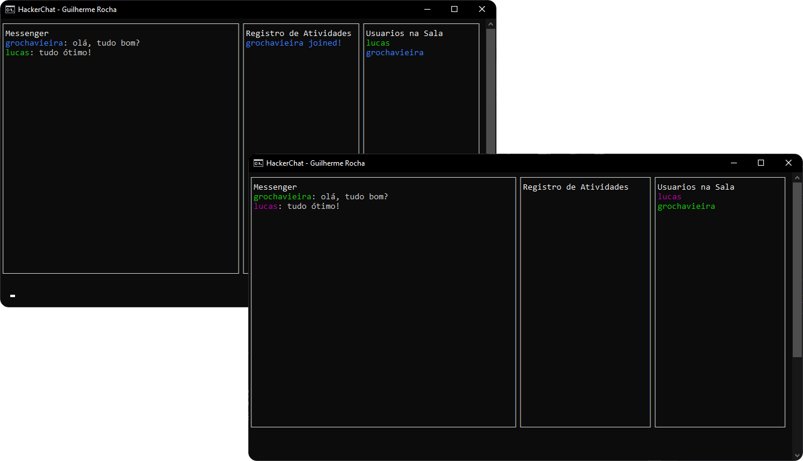

<p align="center">
  

  
  
  <a href="https://github.com/grochavieira/hacker-chat/commits/master">
    
  </a>
    
   
  
</p>

<h1 align="center">
    
</h1>

<h4 align="center"> 
	🚧  Aplicação finalizada! 🚧
</h4>

## 🏁 Tópicos

<p>
 👉<a href="#-sobre-o-projeto" style="text-decoration: none; "> Sobre</a> <br/>
👉<a href="#-funcionalidades" style="text-decoration: none; "> Funcionalidades</a> <br/>
👉<a href="#-layout" style="text-decoration: none"> Layout</a> <br/>
👉<a href="#-como-executar-o-projeto" style="text-decoration: none"> Como executar</a> <br/>
👉<a href="#-tecnologias" style="text-decoration: none"> Tecnologias</a> <br/>
👉<a href="#-autor" style="text-decoration: none"> Autor</a> <br/>
👉<a href="#user-content--licença" style="text-decoration: none"> Licença</a>

</p>

## 💻 Sobre o projeto

Projeto da Semana JSExpert #03 - Um chat no próprio terminal onde é possível conversar com outras pessoas em tempo real por meio de websockets, tudo feito utilizando módulos nativos do Node.js (com excessão da interface, na qual foi usado o blessed).

---

<a name="-funcionalidades"></a>

## ⚙️ Funcionalidades

- [x] Interface no terminal;
- [x] Input para mensagens;
- [x] Seções para visualizar mensagens, registro de atividades e usuários na sala;
- [x] É possível definir seu nome de usuário, sala e conexão ao rodar o programa;
- [x] Quando um usuário entra ou sai de uma sala todos os outros são notificados;
- [x] Um usuário pode mandar mensagem para outros usuários da mesma sala.

---

## 🎨 Layout

### Exemplo do Chat

<h1 align="center">
    
</h1>

---

## 🚀 Como executar o projeto

Este projeto está dividido em 2 partes:

1. Frontend (pasta client)
2. Backend (pasta server)

💡O Frontend precisa que o Backend esteja sendo executado para funcionar, que pode ser encontrado **[AQUI](https://github.com/grochavieira/hacker-chat)**.

### Pré-requisitos

Antes de começar, você vai precisar ter instalado em sua máquina as seguintes ferramentas:
[Git](https://git-scm.com) e [Node.js](https://nodejs.org/en/).
Além disto é bom ter um editor para trabalhar com o código como [VSCode](https://code.visualstudio.com/)

#### 🎲 Rodando o Backend (servidor)

```bash

# Clone este repositório
$ git clone https://github.com/grochavieira/hacker-chat.git

# Acesse a pasta do projeto no terminal/cmd
$ cd hacker-chat

# Vá para a pasta server
$ cd server

# Instale as dependências com npm
$ npm install

# Rode o servidor em modo de desenvolvimento
$ npm run dev

# O servidor inciará na porta:9898 - acesse http://localhost:9898

```

#### 🧭 Rodando o Frontend (cliente)

```bash

# Clone este repositório
$ git clone https://github.com/grochavieira/hacker-chat.git

# Acesse a pasta do projeto no seu terminal/cmd
$ cd hacker-chat

# Vá para a pasta client
$ cd client

# Instale as dependências
$ npm install

# Execute a aplicação em modo de desenvolvimento - primeiro usuário
$ npm run user01

# Execute a aplicação em modo de desenvolvimento - segundo usuário
$ npm run user02

# A aplicação será executada no próprio terminal

# O comando para inserir manualmente o nome de usuário, senha e conexão
# se encontra no package.json da pasta client

```

---

## 🛠 Tecnologias

As seguintes ferramentas foram usadas na construção do projeto:

#### **Cliente** ([NodeJS](https://nodejs.org/en/))

- **[Blessed](https://www.npmjs.com/package/blessed)**

> Veja o arquivo [package.json](https://github.com/grochavieira/hacker-chat/blob/master/client/package.json)

#### **Servidor** ([NodeJS](https://nodejs.org/en/))

- **[Nodemon](https://nodemon.io/)**

> Veja o arquivo [package.json](https://github.com/grochavieira/hacker-chat/blob/master/server/package.json)

#### **Utilitários**

- Editor: **[Visual Studio Code](https://code.visualstudio.com/)**

---

<a name="-autor"></a>

## 🦸‍♂️ **Autor**

<p>
 
 <br />
 <sub><strong>🌟 Guilherme Rocha Vieira 🌟</strong></sub>
</p>

[](https://www.linkedin.com/in/grochavieira/)

---

## 📝 Licença

Este projeto esta sobe a licença [MIT](./LICENSE).

Feito com :satisfied: por Guilherme Rocha Vieira 👋🏽 [Entre em contato!](https://www.linkedin.com/in/grochavieira/)

---
